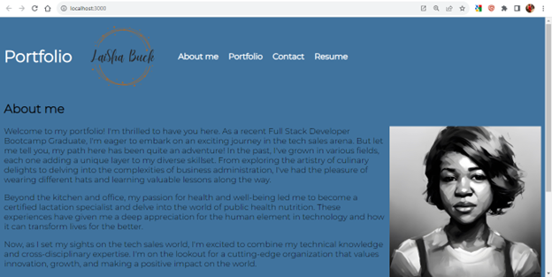

# My Portfolio
This project was created using React, JAX, and CSS. My portfolio provides some insight to past projects and the potential of future endeavors.My personal brand logo was created using Canva. Enjoy the view!

## Badges

## Screenshots

### Installation instructions
1. Install npm install
2. Start server with npm start
3. View App on localhost:3000

The page will reload when you make changes.You may also see any lint errors in the console.

